Here’s a **cleanly structured and consolidated version** of your outline, with redundancy removed, categories properly nested, and content merged under **appropriate files**. I've also included a **short ALT text** for your overall **diagram/image** at the end as requested.

---

## 📂 Project Structure – Cryptography & Privacy Stack

A well-organized breakdown of modern cryptographic primitives, privacy-enhancing technologies, and real-world applications.

---

### **1) Core\_Concepts.md**

**Foundational Primitives & Security Triad**

* **Confidentiality, Integrity, Anonymity** — Core principles of information security.
* **Signatures** — Threshold Signatures, Group Signatures, Blind Signature
* **PRF / HMAC / KDF / MAC** — Pseudorandomness, integrity, and key derivation.
* **Random Oracle Model** — Idealized hash function model for proof soundness.
* **CRS (Common Reference String)** — Setup assumption in NIZKs like zk-SNARKs.
* **Token Binding** — Securely binds authentication tokens to TLS sessions.
* **DID (Decentralized Identifiers)** — Self-sovereign, cryptographic identity.
* **Password-less Authentication** — e.g., FIDO2, WebAuthn.

---

### **2) Zero\_Knowledge\_Proofs.md**

**Proof Without Disclosure**

* **Interactive vs Non-Interactive ZKPs** — (e.g., Fiat–Shamir transformation).
* **zk-SNARKs** — Succinct proofs, require trusted setup.
* **zk-STARKs** — Transparent setup, quantum-resistant.
* **Bulletproofs** — Range proofs, no trusted setup, compact.
* **ZK-Rollups** — On-chain scalability with zero-knowledge aggregation.
* **ZKCP (Contingent Payments)** — Atomic payments with ZK conditions.
* **ZKProofs Community** — Standardization efforts.
* **Trusted vs Transparent Setup** — Foundational for proving systems.

---

### **3) Advanced\_Encryption.md**

**Beyond Basic Encryption**

* **Homomorphic Encryption**

  * **PHE / SHE / FHE** — Enables computation on encrypted data.
* **Functional Encryption (FE)** — Decryption limited to function-specific outputs.
* **Attribute-Based Encryption (ABE)** — Access controlled via policies.
* **PGP (Pretty Good Privacy)** — Hybrid encryption for email/file privacy.
* **AES (Advanced Encryption Standard)** — Symmetric encryption standard.
* **KDF (Key Derivation Function)** — Derives strong keys from weak inputs.
* **MAC / HMAC / PRF** — Ensure message integrity and secure key generation.

---

### **4) Privacy\_in\_Cryptocurrencies.md**

**On-Chain Privacy Techniques**

* **Mixers / Tumblers** — Break transaction traceability.
* **CoinJoin / CoinShuffle / CoinSwap** — Decentralized transaction mixing.
* **Ring Signatures** — One signer hidden in a group (used in Monero).
* **RingCT (Confidential Transactions)** — Hides transaction amounts.
* **Stealth Addresses** — One-time addresses for recipient privacy.
* **Monero** — Combines RingCT + stealth addresses for strong anonymity.
* **Zcash** — zk-SNARKs for fully shielded transactions.
* **BOLT** — Private Lightning Network payments.
* **PPC (Probabilistic Payment Channels)** — Micropayment efficiency.
* **IOUs** — Off-chain instruments for deferred settlement.

---

### **5) Protocols\_and\_Practical\_Applications.md**

**Real-World Secure Protocols**

* **HTTPS / TLS / SSL** — Hybrid encryption for secure web communication.
* **PAKE (Password-Authenticated Key Exchange)** — Secure key agreement from passwords.
* **PSI (Private Set Intersection)** — Compute overlap without revealing full data.
* **OPRF (Oblivious PRF)** — Pseudorandom output without revealing input.
* **Issuer–Holder–Verifier Model** — Digital identity ecosystem.

  * **Claims** — Assertions by issuers (e.g., age, KYC status).
  * **Selective Disclosure** — Reveal only necessary data.
* **EHRs (Electronic Health Records)** — Confidential and privacy-preserving access to medical data.

---

### **6) Advanced\_Protocols\_and\_Models.md**

**Private Computation and Secure Interactions**

* **Secure Multi-Party Computation (MPC)**

  * Enables parties to compute functions jointly without revealing inputs.
  * Includes Secret Sharing (e.g., Shamir’s scheme).
* **Differential Privacy (DP)** — Ensures aggregate data privacy in statistics and ML.
* **Trusted Execution Environments (TEE)** — Secure enclaves (e.g., Intel SGX).
* **Commitment Schemes** — Bind without reveal; used in voting, ZKPs.
* **Oblivious Transfer (OT)** — Sender sends multiple messages; receiver learns only one without revealing which.
* **Secure Channels** — Forward secrecy, deniability in encrypted messaging.
* **Private Information Retrieval (PIR)** — Query data without revealing what is being queried.

---

### **7) Research\_and\_Emerging\_Topics.md**

**What's Next in Crypto & Privacy**

* **Post-Quantum Cryptography** — Lattice, hash, and multivariate-based schemes.
* **Privacy-Preserving AI** — Federated learning, DP, MPC for secure ML.
* **Blockchain Privacy Beyond Currency** — ZK-SNARKs/STARKs for smart contracts.
* **Confidential Computing** — Cloud data protection via hardware (e.g., Azure, GCP, Intel SGX).
* **Zero-Knowledge VMs** — zkEVM, zkWASM enable verifiable smart contract execution.
* **Future Standards**

  * **NIST PQC** — Standardizing post-quantum algorithms.
  * **ZKProof.org** — Efforts to standardize ZK protocols.

---
